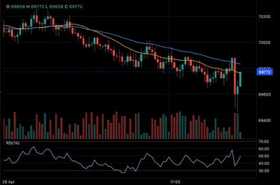
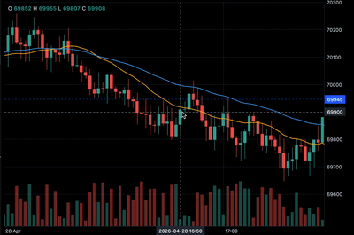

# trading_chart_flutter

Pure-Dart candlestick trading chart for Flutter. Custom `RenderObject` pipeline, no WebView, no JavaScript, no platform channels — runs the same on iOS, Android, macOS, Windows, Linux and Web.

The API is inspired by [Lightweight Charts](https://www.tradingview.com/lightweight-charts/) (data + controller); the gesture model mirrors TradingView (pan, pinch, axis-drag zoom, crosshair, double-tap reset, fling inertia, animated wheel zoom).

<p>
  
  
</p>

## Features

- **Candlestick series** with up/down colors and wicks.
- **Volume histogram** rendered as a separate sub-region with its own price scale.
- **Time axis** with auto bucket-aware ticks (year / month / day / hour boundaries).
- **Price axis** with "nice" ticks (1, 2, 2.5, 5 × 10ⁿ) and adaptive decimals.
- **Crosshair** with axis badges; follows mouse hover, activated by long-press on touch.
- **Last value** dashed price line + colored badge.
- **OHLC legend** in the top-left, switches to hovered candle.
- **Pan / zoom** (drag, pinch, mouse wheel, trackpad).
- **Time-axis drag** zooms time around the right edge.
- **Price-axis drag** switches the price scale to manual mode and zooms vertically.
- **Double-tap** zones reset crosshair, autofit, or time scale.
- **Fling inertia** for fast pan, animated easing for wheel zoom.
- **Imperative `ChartController`** with `setData`, `upsert`, `prependHistory`, `scrollToLatest`, `scrollToTime`, `setVisibleLogicalRange`.
- **`onVisibleRangeChanged` callback** — wire it to load older history when the user scrolls left.

## Getting started

Add to `pubspec.yaml`:

```yaml
dependencies:
  trading_chart_flutter: ^0.0.1
```

Then import:

```dart
import 'package:trading_chart_flutter/trading_chart_flutter.dart';
```

No platform-specific setup required.

## Usage

### Minimal

```dart
import 'package:flutter/material.dart';
import 'package:trading_chart_flutter/trading_chart_flutter.dart';

class MyChart extends StatelessWidget {
  const MyChart({super.key, required this.candles});

  final List<Candle> candles;

  @override
  Widget build(BuildContext context) {
    return InteractiveTradingChart(
      candles: candles,
      theme: ChartTheme.dark,
    );
  }
}
```

`Candle.time` is a Unix timestamp **in seconds**.

### With a controller (live tick + history pagination)

```dart
class _LiveChartState extends State<LiveChart> {
  final _controller = ChartController();
  List<Candle> _candles = [];
  bool _loading = false;

  @override
  void initState() {
    super.initState();
    _loadInitial();
  }

  @override
  void dispose() {
    _controller.dispose();
    super.dispose();
  }

  Future<void> _loadInitial() async {
    final bars = await api.fetchCandles();
    _candles = bars;
    _controller.setData(bars);
    setState(() {});
  }

  void _onTick(double price, int timeMs) {
    final tSec = timeMs ~/ 1000;
    final bucket = tSec - (tSec % 60);            // 1m candles
    final last = _candles.last;
    final updated = bucket == last.time
        ? Candle(
            time: last.time,
            open: last.open,
            high: math.max(last.high, price),
            low: math.min(last.low, price),
            close: price,
            volume: last.volume,
          )
        : Candle(
            time: bucket,
            open: last.close,
            high: price,
            low: price,
            close: price,
          );
    _candles = bucket == last.time
        ? [..._candles.sublist(0, _candles.length - 1), updated]
        : [..._candles, updated];
    _controller.upsert(updated);
  }

  Future<void> _onVisibleRangeChanged(VisibleLogicalRange range) async {
    if (_loading || range.from > 20) return;
    _loading = true;
    final older = await api.fetchCandlesBefore(_candles.first.time);
    _candles = [...older, ..._candles];
    _controller.prependHistory(older);
    _loading = false;
  }

  @override
  Widget build(BuildContext context) {
    return InteractiveTradingChart(
      candles: _candles,
      controller: _controller,
      onVisibleRangeChanged: _onVisibleRangeChanged,
    );
  }
}
```

### Theming

Two presets: `ChartTheme.dark` and `ChartTheme.light`. Pass a custom `ChartTheme(...)` to override colors:

```dart
const myTheme = ChartTheme(
  background: Color(0xFF0E1116),
  text: Color(0xFFD1D4DC),
  axisLine: Color(0xFF2A2E39),
  gridLine: Color(0xFF1B1F27),
  upColor: Color(0xFF26A69A),
  downColor: Color(0xFFEF5350),
  upWick: Color(0xFF26A69A),
  downWick: Color(0xFFEF5350),
  crosshair: Color(0x88B7BDC6),
  crosshairLabelBg: Color(0xFF2A2E39),
  crosshairLabelText: Color(0xFFFFFFFF),
  lastValueLabelBg: Color(0xFF2962FF),
  lastValueLabelText: Color(0xFFFFFFFF),
  priceLine: Color(0x882962FF),
);
```

## Gestures

| Input | Action |
|-------|--------|
| Drag in plot | Pan X |
| Pinch in plot | Zoom X around focal point |
| Drag on time axis (bottom) | Zoom X around right edge |
| Drag on price axis (right) | Manual zoom Y around drag start |
| Mouse wheel in plot | Animated zoom X around cursor |
| Trackpad scroll (vertical) | Zoom X around cursor |
| Trackpad scroll (horizontal) | Pan X |
| Hover (mouse) | Crosshair follows immediately |
| Long-press in plot (touch) | Crosshair on; drag to move; release to hide |
| Double-tap in plot | Scroll to latest |
| Double-tap on price axis | Restore autofit |
| Double-tap on time axis | Reset bar spacing + scroll to latest |
| Fast drag release | Inertial fling |

## Examples

The `example/` folder contains two demos:

- **Synthetic feed** — local random walk price, 1-minute candles, history pagination.
- **OKX live (BTC-USDT)** — REST history + WebSocket trades aggregated into candles in pure Dart.

Run from the package root:

```sh
cd example
flutter run -d macos       # or chrome / ios / android
```

For macOS, the example needs network entitlements; they are already configured.

## Architecture

- `RenderTradingChart` (`RenderBox`) — single render object, paints the entire scene in `paint()`.
- `TimeScale` — maps logical bar index ↔ screen X. Supports clamped pan, anchored zoom, and direct `setSpacingAtAnchorIndex` for drift-free pinch.
- `PriceScale` — maps price ↔ Y. Auto-fit by default, switches to manual mode when the user drags the price axis.
- `CandlestickSeries`, `VolumeHistogramSeries` — drawing logic per series.
- `OverlayPainter` — crosshair, last value, OHLC legend.
- `AxesPainter`, `NiceTicks`, `TimeAxisTicks` — grid, axes, tick generation.
- `ChartController` — imperative API. Buffers calls before the render object attaches.

## Status

Early-stage but usable. APIs may shift between 0.x releases.

## License

MIT.
